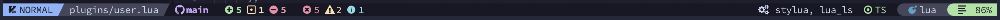

# My AstroNvim configuration

## Custom plugins in plugins/user.lua

- [todo-comments](https://github.com/folke/todo-comments.nvim)
- [catppuccin](https://github.com/catppuccin/nvim): color theme.
- [typescript](https://github.com/jose-elias-alvarez/typescript.nvim): support for web development.
- [clangd_extensions](https://github.com/p00f/clangd_extensions.nvim): support for cpp.
- [cmake-tools](https://github.com/Civitasv/cmake-tools.nvim)

## Core plugins in plugins/core.lua

- [nvim-cpm](https://github.com/hrsh7th/nvim-cmp): added support for tailwindcss
- [heirline](https://github.com/rebelot/heirline.nvim): customized the status bar (inspired by NvChad's status bar)

